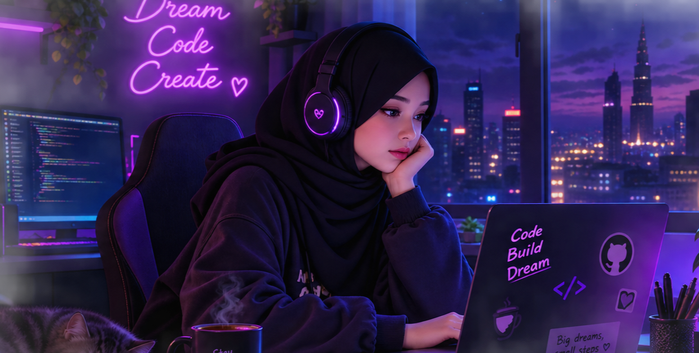

  

<h1 align="center">Hi 👋, I'm [Mulki Isse ]</h1>

<h3 align="center">Software Engineer | Full Stack & Mobile App Developer</h3>

  🎓 Computer Science Student at <b>Himilo University</b>

---

## 👨‍💻 About Me

I am a **Computer Science student at Himilo University** with a strong interest in **Software Engineering, Full Stack Development, and Mobile App Development**.

I am continuously working on improving my programming skills, expanding my technical knowledge, and gaining practical experience in software development, with a particular focus on **building mobile applications**.

###   My Focus

* 💻 Software Engineering
* 🌐 Full Stack Development
* 📱 Mobile App Development
* 📚 Continuous Learning & Skill Development
* 🛠️ Building and improving real-world software projects

##   Languages & Technologies

### 📱 Mobile Development

* Flutter

### 🎨 Frontend Development

* HTML
* CSS
* JavaScript
* React.js

### ⚙️ Backend Development

* PHP
* Express.js

##   Currently Improving

I am focused on continuously developing my knowledge and practical skills in **Software Development**, especially in **Mobile App Development**.

I enjoy learning new technologies, building projects, solving problems, and improving my development skills through practice.

## 🎯 My Goal

My goal is to continue learning, build strong software development skills, and grow into a successful **Software Engineer**, with a strong focus on **Mobile and Full Stack Development**.

---

  <b>💻 Software Development • 📱 Mobile Apps • 🌐 Full Stack • 🚀 Continuous Learning</b>

  Thanks for visiting my GitHub profile! 👋

